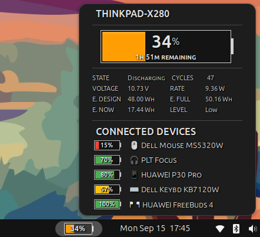
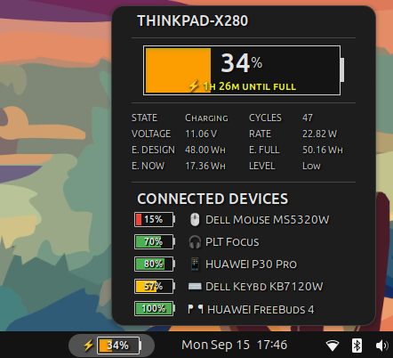

# vantage-battery-widget

  
  

A GNOME Shell extension inspired by Lenovo Vantage battery info
######
This is a battery extension inspired by the Lenovo Vantage battery widget.
I used to enjoy it on Windows, so I created this contribution to bring a similar experience to the GNOME Shell environment.

In the panel bar, the battery gauge displays the current battery percentage.
Clicking the battery icon in the panel opens a tooltip divided into three sections:

**1. Large Battery**

Shows a large battery icon with the current percentage.
Displays the battery state and remaining time while charging or discharging.

**2. Battery Details**

Provides detailed information about the main battery using:
upower -i /org/freedesktop/UPower/devices/battery_BAT0

	-State
	-Energy (full and design)
	-Energy rate
	-Current energy
	-Voltage
	-Charge cycles
	-Level (based on percentage)

**3. Connected Devices Battery Level**

Shows the battery level of each detected Bluetooth device, such as mouse, keyboard, headset, etc.

**NOTE:**

This extension was tested only in ubuntu 24.04 with Gnome shell 46

**INSTALL**

`mkdir -p ~/.local/share/gnome-shell/extensions/vantage-battery@laabca`

`cd ~/.local/share/gnome-shell/extensions/vantage-battery@laabca`

paste the stylesheet.css, extension.js and metadata.json

Then enable the extension

`gnome-extensions enable vantage-battery@laabca`

